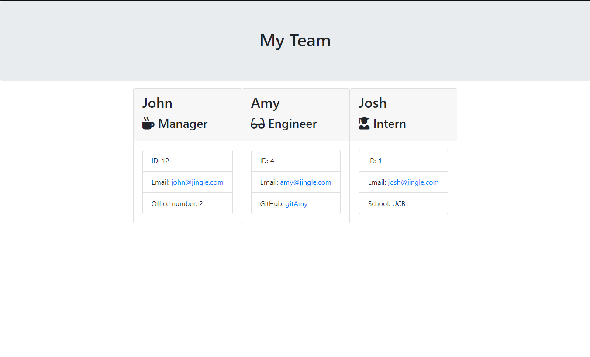

# Team Generator
[](https://www.mit.edu/~amini/LICENSE.md)
<br>
 Team Generator will help create an HTML displaying a team of workers. Teams include a manager, engineers, and interns. Users will be prompted with a series of questions about their team and will be presented with a webpage displaying the team with their info. 
  
 ## Built With
* JavaScript
* HTML
* CSS

## Dependencies
* [Inquirer.js (for all Users)](https://www.npmjs.com/package/inquirer)
* [Jest (for Developers)](https://www.npmjs.com/package/jest)

## Installation
To install dependencies run
```
npm install
```

## Features
Team Generator uses Node.js to run inquirer prompts to grab team member info. Information includes name, ID, email, and more.
<br>



<br>

## Code Example
Inquirer is used to prompt questions:

<br>  

```javaScript

function promptManager(){
    return inquirer.prompt([
        {
            type: "input",
            name: "name",
            message: "Manager Name:"
        },
        {
            type: "input",
            name: "id",
            message: "Manager ID:",
            validate: function (value) {
                var valid = !isNaN(parseFloat(value));
                return valid || 'Please enter a number';
              },
              
        },
        {
            type: "input",
            name: "email",
            message: "Manager Email:"
        },
          
        //etc..

```

<br>
A function is called to collect the data and create a new Engineer for our constructor. Data is then written to the HTML file.
<br>

```javaScript

//create array for history
const team = [];

function runEngineer(){
    promptEngineer().then(function(response){
        const engineer = new Engineer(response.name, response.id, response.email, response.github)
        if(response.another == "Engineer"){
            team.push(engineer);
            runEngineer();
        }else if(response.another == "Intern"){
            team.push(engineer);
            runIntern();
        }else if(response.another == "None"){
            team.push(engineer);
            
            
            fs.writeFile("./output/team.html", render(team),function(err){
                if(err) throw err;
                console.log("Writing team file...")
            });
            return;
        }
    })
}

```

<br>
<br>

# Repository Link:
https://github.com/joshglugatch/employee-summary-engine

<br>

### Author:
Josh Glugatch  

[](https://github.com/joshglugatch)
<br>
[](www.linkedin.com/in/joshua-glugatch)


